# Data Dictionary — CAS1 (Approved Premises)

Generated from JPA entities and Flyway migrations. Entities are the authoritative object
model; migrations are authoritative for physical column types and constraints.

Dictionary data: [cas1.csv](./cas1.csv)

CAS1 entities live in
`jpa/entity/` (root, `Cas1*`-prefixed), `jpa/entity/cas1/` and `cas1/entity/`. Tables
prefixed `cas1_`/`cas_1_` are CAS1-specific. The Approved Premises application/assessment
data is held in the shared `applications`/`assessments` base tables plus the
`approved_premises_applications` / `approved_premises_assessments` subtype tables (see the
[shared dictionary](./shared.md)).

## Entity–Relationship Diagram

```mermaid
erDiagram
    premises ||--o{ cas1_out_of_service_beds : has
    beds ||--o{ cas1_out_of_service_beds : "out of service"
    cas1_out_of_service_beds ||--o{ cas1_out_of_service_bed_revisions : has
    cas1_out_of_service_beds ||--|| cas1_out_of_service_bed_cancellations : "cancelled by"
    cas1_out_of_service_bed_reasons ||--o{ cas1_out_of_service_bed_revisions : categorises
    users ||--o{ cas1_out_of_service_bed_revisions : creates

    premises ||--o{ cas1_space_bookings : has
    approved_premises_applications ||--o{ cas1_space_bookings : has
    placement_requests ||--o{ cas1_space_bookings : fulfils
    offline_applications ||--o| cas1_space_bookings : has
    users ||--o{ cas1_space_bookings : "key worker"
    departure_reasons ||--o{ cas1_space_bookings : categorises
    move_on_categories ||--o{ cas1_space_bookings : categorises
    cancellation_reasons ||--o{ cas1_space_bookings : categorises
    non_arrival_reasons ||--o{ cas1_space_bookings : categorises
    cas1_space_bookings ||--o| cas1_space_bookings : "transferred from"

    placement_requests ||--o{ cas1_change_requests : has
    cas1_space_bookings ||--o{ cas1_change_requests : has
    cas1_change_request_reasons ||--o{ cas1_change_requests : categorises
    cas1_change_request_rejection_reasons ||--o{ cas1_change_requests : "rejected by"
    users ||--o{ cas1_change_requests : decides

    approved_premises_applications ||--o{ cas1_offenders : references
    approved_premises_applications ||--o| cas_1_application_user_details : applicant
    cas1_cru_management_areas ||--o{ approved_premises : manages
```

## Tables

Full column reference (same data as the CSV). One table per database table.

### cas1_change_request_reasons

Entity: `Cas1ChangeRequestReasonEntity`

| Column | Type (SQL) | Kotlin | Nullable | Key | Enum values | Relationship | Notes |
|--------|-----------|--------|----------|-----|-------------|--------------|-------|
| `id` | uuid | UUID | no | PK |  |  |  |
| `code` | text | String | no |  |  |  |  |
| `change_request_type` | text | ChangeRequestType | no |  | PLACEMENT_APPEAL / PLACEMENT_EXTENSION / PLANNED_TRANSFER |  |  |
| `archived` | boolean | Boolean | no |  |  |  | read-only |

### cas1_change_request_rejection_reasons

Entity: `Cas1ChangeRequestRejectionReasonEntity`

| Column | Type (SQL) | Kotlin | Nullable | Key | Enum values | Relationship | Notes |
|--------|-----------|--------|----------|-----|-------------|--------------|-------|
| `id` | uuid | UUID | no | PK |  |  |  |
| `code` | text | String | no |  |  |  |  |
| `change_request_type` | text | ChangeRequestType | no |  | PLACEMENT_APPEAL / PLACEMENT_EXTENSION / PLANNED_TRANSFER |  |  |
| `archived` | boolean | Boolean | no |  |  |  | read-only |

### cas1_change_requests

Entity: `Cas1ChangeRequestEntity`

| Column | Type (SQL) | Kotlin | Nullable | Key | Enum values | Relationship | Notes |
|--------|-----------|--------|----------|-----|-------------|--------------|-------|
| `id` | uuid | UUID | no | PK |  |  | DEPRECATED: developed but never used |
| `placement_request_id` | uuid | UUID | no | FK |  | ManyToOne → placement_requests |  |
| `cas1_space_booking_id` | uuid | UUID | no | FK |  | ManyToOne → cas1_space_bookings |  |
| `type` | text | ChangeRequestType | no |  | PLACEMENT_APPEAL / PLACEMENT_EXTENSION / PLANNED_TRANSFER |  |  |
| `request_json` | text | String | no |  |  |  |  |
| `cas1_change_request_reason_id` | uuid | UUID | no | FK |  | ManyToOne → cas1_change_request_reasons |  |
| `decision_json` | text | String? | yes |  |  |  |  |
| `decision` | text | ChangeRequestDecision? | yes |  | APPROVED / REJECTED |  |  |
| `cas1_change_request_rejection_reason_id` | uuid | UUID? | yes | FK |  | ManyToOne → cas1_change_request_rejection_reasons |  |
| `decision_made_by_user_id` | uuid | UUID? | yes | FK |  | ManyToOne → users |  |
| `resolved` | boolean | Boolean | no |  |  |  |  |
| `resolved_at` | timestamptz | OffsetDateTime? | yes |  |  |  |  |
| `created_at` | timestamptz | OffsetDateTime | no |  |  |  | audit timestamp |
| `updated_at` | timestamptz | OffsetDateTime | no |  |  |  | audit timestamp |
| `version` | bigint | Long | no |  |  |  | @Version optimistic lock |

### cas1_cru_management_areas

Entity: `Cas1CruManagementAreaEntity`

| Column | Type (SQL) | Kotlin | Nullable | Key | Enum values | Relationship | Notes |
|--------|-----------|--------|----------|-----|-------------|--------------|-------|
| `id` | uuid | UUID | no | PK |  |  |  |
| `name` | text | String | no |  |  |  |  |
| `email_address` | text | String? | yes |  |  |  |  |
| `notify_reply_to_email_id` | text | String? | yes |  |  |  |  |

### cas1_form_data

Entity: `Cas1FormDataEntity`

| Column | Type (SQL) | Kotlin | Nullable | Key | Enum values | Relationship | Notes |
|--------|-----------|--------|----------|-----|-------------|--------------|-------|
| `id` | text | String | no | PK |  |  |  |
| `value` | text | String | no |  |  |  | JSON form data |

### cas1_key_worker_staff_code_lookup

Entity: `Cas1KeyWorkerStaffCodeLookupEntity`

| Column | Type (SQL) | Kotlin | Nullable | Key | Enum values | Relationship | Notes |
|--------|-----------|--------|----------|-----|-------------|--------------|-------|
| `staff_code_1` | text | String | no | PK |  |  |  |
| `staff_code_2` | text | String | no |  |  |  | maps staff_code_1 to staff_code_2 |

### cas1_offenders

Entity: `Cas1OffenderEntity`

| Column | Type (SQL) | Kotlin | Nullable | Key | Enum values | Relationship | Notes |
|--------|-----------|--------|----------|-----|-------------|--------------|-------|
| `id` | uuid | UUID | no | PK |  |  |  |
| `crn` | text | String | no |  |  |  |  |
| `noms_number` | text | String? | yes |  |  |  |  |
| `name` | text | String | no |  |  |  | search only; use OffenderService for display (LAO) |
| `tier` | text | String? | yes |  |  |  |  |
| `created_at` | timestamptz | OffsetDateTime | no |  |  |  | audit timestamp |
| `last_updated_at` | timestamptz | OffsetDateTime | no |  |  |  | audit timestamp |
| `version` | bigint | Long | no |  |  |  | @Version optimistic lock |

### cas1_out_of_service_bed_cancellations

Entity: `Cas1OutOfServiceBedCancellationEntity`

| Column | Type (SQL) | Kotlin | Nullable | Key | Enum values | Relationship | Notes |
|--------|-----------|--------|----------|-----|-------------|--------------|-------|
| `id` | uuid | UUID | no | PK |  |  |  |
| `created_at` | timestamptz | OffsetDateTime | no |  |  |  | audit timestamp |
| `notes` | text | String? | yes |  |  |  |  |
| `out_of_service_bed_id` | uuid | UUID | no | FK |  | OneToOne → cas1_out_of_service_beds |  |

### cas1_out_of_service_bed_reasons

Entity: `Cas1OutOfServiceBedReasonEntity`

| Column | Type (SQL) | Kotlin | Nullable | Key | Enum values | Relationship | Notes |
|--------|-----------|--------|----------|-----|-------------|--------------|-------|
| `id` | uuid | UUID | no | PK |  |  |  |
| `created_at` | timestamptz | OffsetDateTime | no |  |  |  | audit timestamp |
| `name` | text | String | no |  |  |  |  |
| `is_active` | boolean | Boolean | no |  |  |  |  |
| `reference_type` | text | Cas1OutOfServiceBedReasonEntityReferenceType | no |  | CRN / WORK_ORDER |  |  |

### cas1_out_of_service_bed_revisions

Entity: `Cas1OutOfServiceBedRevisionEntity`

| Column | Type (SQL) | Kotlin | Nullable | Key | Enum values | Relationship | Notes |
|--------|-----------|--------|----------|-----|-------------|--------------|-------|
| `id` | uuid | UUID | no | PK |  |  |  |
| `created_at` | timestamptz | OffsetDateTime | no |  |  |  | audit timestamp |
| `revision_type` | text | Cas1OutOfServiceBedRevisionType | no |  | INITIAL / UPDATE |  |  |
| `start_date` | date | LocalDate | no |  |  |  | inclusive |
| `end_date` | date | LocalDate | no |  |  |  | inclusive |
| `reference_number` | text | String? | yes |  |  |  | determined by reason.referenceType |
| `notes` | text | String? | yes |  |  |  |  |
| `out_of_service_bed_reason_id` | uuid | UUID | no | FK |  | ManyToOne → cas1_out_of_service_bed_reasons |  |
| `out_of_service_bed_id` | uuid | UUID | no | FK |  | ManyToOne → cas1_out_of_service_beds |  |
| `created_by_user_id` | uuid | UUID? | yes | FK |  | ManyToOne → users |  |
| `change_type` | bigint | Long | no |  |  |  | packed bitfield of change types |

### cas1_out_of_service_beds

Entity: `Cas1OutOfServiceBedEntity`

| Column | Type (SQL) | Kotlin | Nullable | Key | Enum values | Relationship | Notes |
|--------|-----------|--------|----------|-----|-------------|--------------|-------|
| `id` | uuid | UUID | no | PK |  |  |  |
| `premises_id` | uuid | UUID | no | FK |  | ManyToOne → premises |  |
| `bed_id` | uuid | UUID | no | FK |  | ManyToOne → beds |  |
| `created_at` | timestamptz | OffsetDateTime | no |  |  |  | audit timestamp |

### cas1_premises_local_restrictions

Entity: `Cas1PremisesLocalRestrictionEntity`

| Column | Type (SQL) | Kotlin | Nullable | Key | Enum values | Relationship | Notes |
|--------|-----------|--------|----------|-----|-------------|--------------|-------|
| `id` | uuid | UUID | no | PK |  |  |  |
| `description` | text | String | no |  |  |  |  |
| `created_at` | timestamptz | OffsetDateTime | no |  |  |  | audit timestamp |
| `created_by_user_id` | uuid | UUID | no |  |  |  |  |
| `approved_premises_id` | uuid | UUID | no |  |  |  | premises restriction applies to |
| `archived` | boolean | Boolean | no |  |  |  | default false |

### cas1_space_bookings

Entity: `Cas1SpaceBookingEntity`

| Column | Type (SQL) | Kotlin | Nullable | Key | Enum values | Relationship | Notes |
|--------|-----------|--------|----------|-----|-------------|--------------|-------|
| `id` | uuid | UUID | no | PK |  |  |  |
| `premises_id` | uuid | UUID | no | FK |  | ManyToOne → premises |  |
| `approved_premises_application_id` | uuid | UUID? | yes | FK |  | ManyToOne → approved_premises_applications |  |
| `offline_application_id` | uuid | UUID? | yes | FK |  | OneToOne → offline_applications |  |
| `placement_request_id` | uuid | UUID? | yes | FK |  | ManyToOne → placement_requests | null for legacy/migrated |
| `created_by_user_id` | uuid | UUID? | yes | FK |  | ManyToOne → users | null for migrated bookings |
| `created_at` | timestamptz | OffsetDateTime | no |  |  |  | audit timestamp |
| `expected_arrival_date` | date | LocalDate | no |  |  |  |  |
| `expected_departure_date` | date | LocalDate | no |  |  |  |  |
| `actual_arrival_date` | date | LocalDate? | yes |  |  |  |  |
| `actual_arrival_time` | time | LocalTime? | yes |  |  |  | may be null from delius imports |
| `actual_departure_date` | date | LocalDate? | yes |  |  |  |  |
| `actual_departure_time` | time | LocalTime? | yes |  |  |  | may be null from delius imports |
| `canonical_arrival_date` | date | LocalDate | no |  |  |  | for occupancy calc |
| `canonical_departure_date` | date | LocalDate | no |  |  |  | for occupancy calc |
| `crn` | text | String | no |  |  |  |  |
| `key_worker_user_id` | uuid | UUID? | yes | FK |  | ManyToOne → users | migrating from staffCode/Name |
| `key_worker_staff_code` | text | String? | yes |  |  |  | legacy |
| `key_worker_name` | text | String? | yes |  |  |  | legacy |
| `key_worker_assigned_at` | timestamptz | Instant? | yes |  |  |  |  |
| `departure_reason_id` | uuid | UUID? | yes | FK |  | ManyToOne → departure_reasons |  |
| `departure_move_on_category_id` | uuid | UUID? | yes | FK |  | ManyToOne → move_on_categories |  |
| `departure_notes` | text | String? | yes |  |  |  |  |
| `cancellation_occurred_at` | date | LocalDate? | yes |  |  |  |  |
| `cancellation_recorded_at` | timestamptz | Instant? | yes |  |  |  |  |
| `cancellation_reason_id` | uuid | UUID? | yes | FK |  | ManyToOne → cancellation_reasons |  |
| `cancellation_reason_notes` | text | String? | yes |  |  |  |  |
| `non_arrival_confirmed_at` | timestamptz | Instant? | yes |  |  |  |  |
| `non_arrival_reason_id` | uuid | UUID? | yes | FK |  | ManyToOne → non_arrival_reasons |  |
| `non_arrival_notes` | text | String? | yes |  |  |  |  |
| `delius_event_number` | text | String? | yes |  |  |  |  |
| `migrated_management_info_from` | text | ManagementInfoSource? | yes |  | DELIUS / LEGACY_CAS_1 |  |  |
| `delius_id` | text | String? | yes |  |  |  | delius referral id for support |
| `transferred_from` | uuid | UUID? | yes | FK |  | OneToOne → cas1_space_bookings | deprecated; use transfer_type |
| `transfer_type` | text | TransferType? | yes |  | PLANNED / EMERGENCY | deprecated |  |
| `transfer_reason` | text | TransferReason? | yes |  | TransferReason |  |  |
| `additional_information` | text | String? | yes |  |  |  |  |
| `version` | bigint | Long | no |  |  |  | @Version optimistic lock |

### cas_1_application_user_details

Entity: `Cas1ApplicationUserDetailsEntity`

| Column | Type (SQL) | Kotlin | Nullable | Key | Enum values | Relationship | Notes |
|--------|-----------|--------|----------|-----|-------------|--------------|-------|
| `id` | uuid | UUID | no | PK |  |  |  |
| `name` | text | String | no |  |  |  |  |
| `email` | text | String? | yes |  |  |  |  |
| `telephone_number` | text | String? | yes |  |  |  |  |

## Sources

| Area | Location |
|------|----------|
| Entity packages | [jpa/entity/cas1/](src/main/kotlin/uk/gov/justice/digital/hmpps/approvedpremisesapi/jpa/entity/cas1), [cas1/entity/](src/main/kotlin/uk/gov/justice/digital/hmpps/approvedpremisesapi/cas1/entity) and `Cas1*` files in [jpa/entity/](src/main/kotlin/uk/gov/justice/digital/hmpps/approvedpremisesapi/jpa/entity) |
| Migrations | [db/migration/all/](src/main/resources/db/migration/all) |

> `cas1_change_requests` is present in the schema but flagged DEPRECATED (developed but never used).
