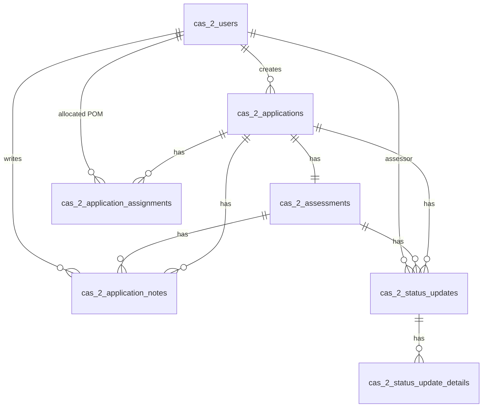

# Data Dictionary — CAS2 (Transitional Accommodation / HDC & Bail)

Generated from JPA entities and Flyway migrations. Entities are the authoritative object
model; migrations are authoritative for physical column types and constraints.

Dictionary data: [cas2.csv](./cas2.csv)

CAS2 entities live in `cas2hdc/jpa/entity/` and `cas2/jpa/entity/`. The service is
mid-migration: `cas_2_users` is the consolidated user model that supersedes the legacy
`nomis_users` and `external_users` tables, and `cas_2_application_live_summary` is a
read-only view-backed entity.

## Entity–Relationship Diagram

## Tables

Full column reference (same data as the CSV). One table per database table.

### cas_2_application_assignments

Entity: `Cas2ApplicationAssignmentEntity`

| Column | Type (SQL) | Kotlin | Nullable | Key | Enum values | Relationship | Notes |
|--------|-----------|--------|----------|-----|-------------|--------------|-------|
| `id` | uuid | UUID | no | PK |  |  |  |
| `application_id` | uuid | UUID | no | FK |  | ManyToOne → cas_2_applications | FetchType.LAZY |
| `prison_code` | text | String | no |  |  |  |  |
| `allocated_pom_cas_2_user_id` | uuid | UUID? | yes | FK |  | ManyToOne → cas_2_users |  |
| `created_at` | timestamptz | OffsetDateTime | no |  |  |  |  |

### cas_2_application_live_summary

Entity: `Cas2ApplicationSummaryEntity`

| Column | Type (SQL) | Kotlin | Nullable | Key | Enum values | Relationship | Notes |
|--------|-----------|--------|----------|-----|-------------|--------------|-------|
| `id` | uuid | UUID | no | PK |  |  | View-mapped entity (cas_2_application_summary / _live) |
| `crn` | text | String | no |  |  |  |  |
| `noms_number` | text | String | no |  |  |  |  |
| `created_by_cas2_user_id` | text | String | no |  |  |  |  |
| `created_by_cas2_user_name` | text | String | no |  |  |  |  |
| `allocated_pom_cas_2_user_id` | uuid | UUID? | yes |  |  |  |  |
| `allocated_pom_cas_2_name` | text | String? | yes |  |  |  |  |
| `created_at` | timestamptz | OffsetDateTime | no |  |  |  |  |
| `submitted_at` | timestamptz | OffsetDateTime? | yes |  |  |  |  |
| `abandoned_at` | timestamptz | OffsetDateTime? | yes |  |  |  |  |
| `hdc_eligibility_date` | date | LocalDate? | yes |  |  |  |  |
| `label` | text | String? | yes |  |  |  |  |
| `status_id` | text | String? | yes |  |  |  |  |
| `referring_prison_code` | text | String | no |  |  |  |  |
| `current_prison_code` | text | String? | yes |  |  |  |  |
| `assignment_date` | timestamptz | OffsetDateTime? | yes |  |  |  |  |
| `bail_hearing_date` | date | LocalDate? | yes |  |  |  |  |
| `application_origin` | text | String? | yes |  |  |  |  |
| `service_origin` | text | String? | yes |  |  |  |  |
| `cohort` | text | Cas2Cohort? | yes |  | HDC / PRISON_BAIL / COURT_BAIL / ATCR / HCRD / HEFR / ISC / RARR / FROM_AP |  |  |

### cas_2_application_notes

Entity: `Cas2ApplicationNoteEntity`

| Column | Type (SQL) | Kotlin | Nullable | Key | Enum values | Relationship | Notes |
|--------|-----------|--------|----------|-----|-------------|--------------|-------|
| `id` | uuid | UUID | no | PK |  |  |  |
| `created_by_cas2_user_id` | uuid | UUID | no | FK |  | ManyToOne → cas_2_users |  |
| `application_id` | uuid | UUID | no | FK |  | ManyToOne → cas_2_applications |  |
| `created_at` | timestamptz | OffsetDateTime | no |  |  |  |  |
| `body` | text | String | no |  |  |  |  |
| `assessment_id` | uuid | UUID? | yes | FK |  | ManyToOne → cas_2_assessments |  |

### cas_2_applications

Entity: `Cas2ApplicationEntity`

| Column | Type (SQL) | Kotlin | Nullable | Key | Enum values | Relationship | Notes |
|--------|-----------|--------|----------|-----|-------------|--------------|-------|
| `id` | uuid | UUID | no | PK |  |  |  |
| `crn` | text | String | no |  |  |  |  |
| `created_by_cas2_user_id` | uuid | UUID | no | FK |  | ManyToOne → cas_2_users |  |
| `data` | jsonb | String? | yes |  |  |  |  |
| `document` | jsonb | String? | yes |  |  |  |  |
| `created_at` | timestamptz | OffsetDateTime | no |  |  |  |  |
| `submitted_at` | timestamptz | OffsetDateTime? | yes |  |  |  |  |
| `abandoned_at` | timestamptz | OffsetDateTime? | yes |  |  |  |  |
| `noms_number` | text | String? | yes |  |  |  |  |
| `referring_prison_code` | text | String? | yes |  |  |  |  |
| `preferred_areas` | text | String? | yes |  |  |  |  |
| `hdc_eligibility_date` | date | LocalDate? | yes |  |  |  |  |
| `conditional_release_date` | date | LocalDate? | yes |  |  |  |  |
| `telephone_number` | text | String? | yes |  |  |  |  |
| `bail_hearing_date` | date | LocalDate? | yes |  |  |  |  |
| `application_origin` | text | ApplicationOrigin | no |  | courtBail / prisonBail / homeDetentionCurfew / other |  |  |
| `service_origin` | text | Cas2ServiceOrigin | no |  | BAIL / HDC |  |  |
| `cohort` | text | Cas2Cohort? | yes |  | HDC / PRISON_BAIL / COURT_BAIL / ATCR / HCRD / HEFR / ISC / RARR / FROM_AP |  |  |

### cas_2_assessments

Entity: `Cas2AssessmentEntity`

| Column | Type (SQL) | Kotlin | Nullable | Key | Enum values | Relationship | Notes |
|--------|-----------|--------|----------|-----|-------------|--------------|-------|
| `id` | uuid | UUID | no | PK |  |  |  |
| `application_id` | uuid | UUID | no | FK |  | OneToOne → cas_2_applications | owning side |
| `created_at` | timestamptz | OffsetDateTime | no |  |  |  |  |
| `nacro_referral_id` | text | String? | yes |  |  |  |  |
| `assessor_name` | text | String? | yes |  |  |  |  |
| `service_origin` | text | Cas2ServiceOrigin | no |  | BAIL / HDC |  |  |

### cas_2_status_update_details

Entity: `Cas2StatusUpdateDetailEntity`

| Column | Type (SQL) | Kotlin | Nullable | Key | Enum values | Relationship | Notes |
|--------|-----------|--------|----------|-----|-------------|--------------|-------|
| `id` | uuid | UUID | no | PK |  |  |  |
| `status_detail_id` | uuid | UUID | no |  |  |  |  |
| `label` | text | String | no |  |  |  |  |
| `status_update_id` | uuid | UUID | no | FK |  | ManyToOne → cas_2_status_updates |  |
| `created_at` | timestamptz | OffsetDateTime | no |  |  |  |  |

### cas_2_status_updates

Entity: `Cas2StatusUpdateEntity`

| Column | Type (SQL) | Kotlin | Nullable | Key | Enum values | Relationship | Notes |
|--------|-----------|--------|----------|-----|-------------|--------------|-------|
| `id` | uuid | UUID | no | PK |  |  |  |
| `status_id` | uuid | UUID | no |  |  |  |  |
| `description` | text | String | no |  |  |  |  |
| `label` | text | String | no |  |  |  |  |
| `cas2_user_assessor_id` | uuid | UUID | no | FK |  | ManyToOne → cas_2_users |  |
| `application_id` | uuid | UUID | no | FK |  | ManyToOne → cas_2_applications |  |
| `assessment_id` | uuid | UUID? | yes | FK |  | ManyToOne → cas_2_assessments |  |
| `created_at` | timestamptz | OffsetDateTime | no |  |  |  | audit timestamp |

### cas_2_users

Entity: `Cas2UserEntity`

| Column | Type (SQL) | Kotlin | Nullable | Key | Enum values | Relationship | Notes |
|--------|-----------|--------|----------|-----|-------------|--------------|-------|
| `id` | uuid | UUID | no | PK |  |  |  |
| `username` | text | String | no |  |  |  |  |
| `email` | text | String? | yes |  |  |  |  |
| `name` | text | String | no |  |  |  |  |
| `user_type` | text | Cas2UserType | no |  | DELIUS / NOMIS / EXTERNAL |  |  |
| `external_type` | text | String? | yes |  |  |  |  |
| `nomis_staff_id` | bigint | Long? | yes |  |  |  |  |
| `active_nomis_caseload_id` | text | String? | yes |  |  |  | corresponds to prison code |
| `nomis_account_type` | text | String? | yes |  |  |  |  |
| `delius_team_codes` | text | List<String>? | yes |  |  |  | StringListConverter |
| `delius_staff_code` | text | String? | yes |  |  |  |  |
| `is_enabled` | boolean | Boolean | no |  |  |  |  |
| `is_active` | boolean | Boolean | no |  |  |  |  |
| `created_at` | timestamptz | OffsetDateTime | no |  |  |  |  |
| `service_origin` | text | Cas2ServiceOrigin | no |  | BAIL / HDC |  |  |

### external_users

Entity: `ExternalUserEntity`

| Column | Type (SQL) | Kotlin | Nullable | Key | Enum values | Relationship | Notes |
|--------|-----------|--------|----------|-----|-------------|--------------|-------|
| `id` | uuid | UUID | no | PK |  |  | legacy; superseded by cas_2_users |
| `username` | text | String | no |  |  |  |  |
| `is_enabled` | boolean | Boolean | no |  |  |  |  |
| `origin` | text | String | no |  |  |  |  |
| `name` | text | String | no |  |  |  |  |
| `email` | text | String | no |  |  |  |  |
| `created_at` | timestamptz | OffsetDateTime | no |  |  |  |  |

### nomis_users

Entity: `NomisUserEntity`

| Column | Type (SQL) | Kotlin | Nullable | Key | Enum values | Relationship | Notes |
|--------|-----------|--------|----------|-----|-------------|--------------|-------|
| `id` | uuid | UUID | no | PK |  |  | legacy; superseded by cas_2_users |
| `nomis_username` | text | String | no |  |  |  |  |
| `nomis_staff_id` | bigint | Long | no |  |  |  |  |
| `name` | text | String | no |  |  |  |  |
| `account_type` | text | String | no |  |  |  |  |
| `is_enabled` | boolean | Boolean | no |  |  |  |  |
| `is_active` | boolean | Boolean | no |  |  |  |  |
| `email` | text | String? | yes |  |  |  |  |
| `active_caseload_id` | text | String? | yes |  |  |  |  |
| `created_at` | timestamptz | OffsetDateTime | no |  |  |  |  |

## Sources

| Area | Location |
|------|----------|
| Entity packages | [cas2hdc/jpa/entity/](src/main/kotlin/uk/gov/justice/digital/hmpps/approvedpremisesapi/cas2hdc/jpa/entity), [cas2/jpa/entity/](src/main/kotlin/uk/gov/justice/digital/hmpps/approvedpremisesapi/cas2/jpa/entity) |
| Migrations | [db/migration/all/](src/main/resources/db/migration/all) |

> `nomis_users` and `external_users` are legacy and superseded by `cas_2_users`.
