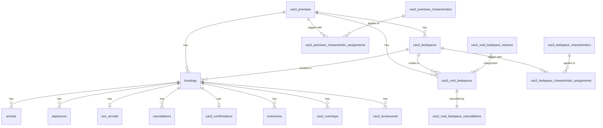

# Data Dictionary — CAS3 (Temporary Accommodation)

Generated from JPA entities and Flyway migrations. Entities are the authoritative object
model; migrations are authoritative for physical column types and constraints.

Dictionary data: [cas3.csv](./cas3.csv)

CAS3 entities live in `cas3/jpa/entity/` with a `v2/` subpackage. The `Cas3v2*` entities
(`Cas3v2ConfirmationEntity`, `Cas3v2TurnaroundEntity`) map to the same `cas3_confirmations`
and `cas3_turnarounds` tables as their v1 counterparts — they represent the v2 model
iteration, not separate tables. CAS3 still references some shared reference tables
(`departure_reasons`, `move_on_categories`, `cancellation_reasons`, `non_arrival_reasons`,
`destination_providers`) and, for deprecated v1 columns, the shared `premises`/`beds`.

## Entity–Relationship Diagram

## Tables

Full column reference (same data as the CSV). One table per database table.

### arrivals

Entity: `Cas3ArrivalEntity`

| Column | Type (SQL) | Kotlin | Nullable | Key | Enum values | Relationship | Notes |
|--------|-----------|--------|----------|-----|-------------|--------------|-------|
| `id` | uuid | UUID | no | PK |  |  |  |
| `arrival_date` | date | LocalDate | no |  |  |  |  |
| `arrival_date_time` | timestamptz | Instant | no |  |  |  |  |
| `expected_departure_date` | date | LocalDate | no |  |  |  |  |
| `notes` | text | String? | yes |  |  |  |  |
| `created_at` | timestamptz | OffsetDateTime | no |  |  |  | audit timestamp |
| `booking_id` | uuid | UUID | no | FK |  | ManyToOne → bookings |  |

### bookings

Entity: `Cas3BookingEntity`

| Column | Type (SQL) | Kotlin | Nullable | Key | Enum values | Relationship | Notes |
|--------|-----------|--------|----------|-----|-------------|--------------|-------|
| `id` | uuid | UUID | no | PK |  |  |  |
| `crn` | text | String | no |  |  |  |  |
| `arrival_date` | date | LocalDate | no |  |  |  |  |
| `departure_date` | date | LocalDate | no |  |  |  |  |
| `service` | text | String | no |  |  |  |  |
| `original_arrival_date` | date | LocalDate | no |  |  |  |  |
| `original_departure_date` | date | LocalDate | no |  |  |  |  |
| `created_at` | timestamptz | OffsetDateTime | no |  |  |  | audit timestamp |
| `noms_number` | text | String? | yes |  |  |  |  |
| `status` | text | Cas3BookingStatus? | yes |  | Cas3BookingStatus |  |  |
| `version` | bigint | Long | no |  |  |  | @Version optimistic lock |
| `offender_name` | text | String? | yes |  |  |  |  |
| `premises_id` | uuid | UUID | no | FK |  | ManyToOne → cas3_premises |  |
| `bed_id` | uuid | UUID | yes | FK |  | ManyToOne → cas3_bedspaces | nullable in DB (migration 20221115123112 adds bed_id without NOT NULL); JPA association is non-null |
| `application_id` | uuid | UUID? | yes | FK |  | OneToOne → applications |  |

### cancellations

Entity: `Cas3CancellationEntity`

| Column | Type (SQL) | Kotlin | Nullable | Key | Enum values | Relationship | Notes |
|--------|-----------|--------|----------|-----|-------------|--------------|-------|
| `id` | uuid | UUID | no | PK |  |  |  |
| `date` | date | LocalDate | no |  |  |  |  |
| `cancellation_reason_id` | uuid | UUID | no | FK |  | ManyToOne → cancellation_reasons |  |
| `notes` | text | String? | yes |  |  |  |  |
| `created_at` | timestamptz | OffsetDateTime | no |  |  |  | audit timestamp |
| `booking_id` | uuid | UUID | no | FK |  | ManyToOne → bookings |  |
| `other_reason` | text | String? | yes |  |  |  |  |

### cas3_bedspace_characteristics

Entity: `Cas3BedspaceCharacteristicEntity`

| Column | Type (SQL) | Kotlin | Nullable | Key | Enum values | Relationship | Notes |
|--------|-----------|--------|----------|-----|-------------|--------------|-------|
| `id` | uuid | UUID | no | PK |  |  |  |
| `name` | text | String? | yes |  |  |  |  |
| `description` | text | String | no |  |  |  |  |
| `is_active` | boolean | Boolean | no |  |  |  |  |

### cas3_bedspace_characteristic_assignments

Entity: `Cas3BedspacesEntity` (join table for `characteristics`)

| Column | Type (SQL) | Kotlin | Nullable | Key | Enum values | Relationship | Notes |
|--------|-----------|--------|----------|-----|-------------|--------------|-------|
| `bedspace_id` | uuid | UUID | no | PK,FK |  | ManyToMany join table (characteristics) → cas3_bedspaces | @JoinTable on Cas3BedspacesEntity.characteristics |
| `bedspace_characteristics_id` | uuid | UUID | no | PK,FK |  | ManyToMany join table (characteristics) → cas3_bedspace_characteristics |  |

### cas3_bedspaces

Entity: `Cas3BedspacesEntity`

| Column | Type (SQL) | Kotlin | Nullable | Key | Enum values | Relationship | Notes |
|--------|-----------|--------|----------|-----|-------------|--------------|-------|
| `id` | uuid | UUID | no | PK |  |  |  |
| `premises_id` | uuid | UUID | no | FK |  | ManyToOne → cas3_premises |  |
| `reference` | text | String | no |  |  |  |  |
| `notes` | text | String? | yes |  |  |  |  |
| `start_date` | date | LocalDate | no |  |  |  |  |
| `end_date` | date | LocalDate? | yes |  |  |  |  |
| `created_at` | timestamptz | OffsetDateTime | no |  |  |  | audit timestamp |
| `created_date` | date | LocalDate | no |  |  |  |  |

### cas3_confirmations

Entity: `Cas3ConfirmationEntity`, `Cas3v2ConfirmationEntity`

> Note: this single physical `cas3_confirmations` table is mapped by two JPA entities — `Cas3ConfirmationEntity` (v1) and `Cas3v2ConfirmationEntity` (v2). The columns are listed once below; both entities map to the same columns.

| Column | Type (SQL) | Kotlin | Nullable | Key | Enum values | Relationship | Notes |
|--------|-----------|--------|----------|-----|-------------|--------------|-------|
| `id` | uuid | UUID | no | PK |  |  | physical table mapped by Cas3ConfirmationEntity (v1) and Cas3v2ConfirmationEntity (v2) |
| `date_time` | timestamptz | OffsetDateTime | no |  |  |  |  |
| `notes` | text | String? | yes |  |  |  |  |
| `created_at` | timestamptz | OffsetDateTime | no |  |  |  | audit timestamp |
| `booking_id` | uuid | UUID | no | FK |  | OneToOne → bookings |  |

### cas3_overstays

Entity: `Cas3OverstayEntity`

| Column | Type (SQL) | Kotlin | Nullable | Key | Enum values | Relationship | Notes |
|--------|-----------|--------|----------|-----|-------------|--------------|-------|
| `id` | uuid | UUID | no | PK |  |  |  |
| `previous_departure_date` | date | LocalDate | no |  |  |  |  |
| `new_departure_date` | date | LocalDate | no |  |  |  |  |
| `is_authorised` | boolean | Boolean | no |  |  |  |  |
| `reason` | text | String? | yes |  |  |  |  |
| `created_at` | timestamptz | OffsetDateTime | no |  |  |  | audit timestamp |
| `booking_id` | uuid | UUID | no | FK |  | ManyToOne → bookings |  |

### cas3_premises

Entity: `Cas3PremisesEntity`

| Column | Type (SQL) | Kotlin | Nullable | Key | Enum values | Relationship | Notes |
|--------|-----------|--------|----------|-----|-------------|--------------|-------|
| `id` | uuid | UUID | no | PK |  |  |  |
| `name` | text | String | no |  |  |  |  |
| `postcode` | text | String | no |  |  |  |  |
| `address_line1` | text | String | no |  |  |  |  |
| `address_line2` | text | String? | yes |  |  |  |  |
| `town` | text | String? | yes |  |  |  |  |
| `status` | text | Cas3PremisesStatus | no |  | Cas3PremisesStatus |  |  |
| `notes` | text | String | no |  |  |  |  |
| `start_date` | date | LocalDate | no |  |  |  |  |
| `end_date` | date | LocalDate? | yes |  |  |  |  |
| `probation_delivery_unit_id` | uuid | UUID | no | FK |  | ManyToOne → probation_delivery_units |  |
| `local_authority_area_id` | uuid | UUID? | yes | FK |  | ManyToOne → local_authority_areas |  |
| `turnaround_working_days` | integer | Int | no |  |  |  |  |
| `created_at` | timestamptz | OffsetDateTime | no |  |  |  | audit timestamp |
| `last_updated_at` | timestamptz | OffsetDateTime? | yes |  |  |  | audit timestamp |

### cas3_premises_characteristics

Entity: `Cas3PremisesCharacteristicEntity`

| Column | Type (SQL) | Kotlin | Nullable | Key | Enum values | Relationship | Notes |
|--------|-----------|--------|----------|-----|-------------|--------------|-------|
| `id` | uuid | UUID | no | PK |  |  |  |
| `name` | text | String | no |  |  |  |  |
| `description` | text | String | no |  |  |  |  |
| `is_active` | boolean | Boolean | no |  |  |  |  |

### cas3_premises_characteristic_assignments

Entity: `Cas3PremisesEntity` (join table for `characteristics`)

| Column | Type (SQL) | Kotlin | Nullable | Key | Enum values | Relationship | Notes |
|--------|-----------|--------|----------|-----|-------------|--------------|-------|
| `premises_id` | uuid | UUID | no | PK,FK |  | ManyToMany join table (characteristics) → cas3_premises | @JoinTable on Cas3PremisesEntity.characteristics |
| `premises_characteristics_id` | uuid | UUID | no | PK,FK |  | ManyToMany join table (characteristics) → cas3_premises_characteristics |  |

### cas3_turnarounds

Entity: `Cas3TurnaroundEntity`, `Cas3v2TurnaroundEntity`

> Note: this single physical `cas3_turnarounds` table is mapped by two JPA entities — `Cas3TurnaroundEntity` (v1) and `Cas3v2TurnaroundEntity` (v2). The columns are listed once below; both entities map to the same columns.

| Column | Type (SQL) | Kotlin | Nullable | Key | Enum values | Relationship | Notes |
|--------|-----------|--------|----------|-----|-------------|--------------|-------|
| `id` | uuid | UUID | no | PK |  |  | physical table mapped by Cas3TurnaroundEntity (v1) and Cas3v2TurnaroundEntity (v2) |
| `working_day_count` | integer | Int | no |  |  |  |  |
| `created_at` | timestamptz | OffsetDateTime | no |  |  |  | audit timestamp |
| `booking_id` | uuid | UUID | no | FK |  | ManyToOne → bookings |  |

### cas3_void_bedspace_cancellations

Entity: `Cas3VoidBedspaceCancellationEntity`

| Column | Type (SQL) | Kotlin | Nullable | Key | Enum values | Relationship | Notes |
|--------|-----------|--------|----------|-----|-------------|--------------|-------|
| `id` | uuid | UUID | no | PK |  |  |  |
| `created_at` | timestamptz | OffsetDateTime | no |  |  |  | audit timestamp |
| `notes` | text | String? | yes |  |  |  |  |
| `cas3_void_bedspace_id` | uuid | UUID | no | FK |  | OneToOne → cas3_void_bedspaces |  |

### cas3_void_bedspace_reasons

Entity: `Cas3VoidBedspaceReasonEntity`

| Column | Type (SQL) | Kotlin | Nullable | Key | Enum values | Relationship | Notes |
|--------|-----------|--------|----------|-----|-------------|--------------|-------|
| `id` | uuid | UUID | no | PK |  |  |  |
| `name` | text | String | no |  |  |  |  |
| `is_active` | boolean | Boolean | no |  |  |  |  |

### cas3_void_bedspaces

Entity: `Cas3VoidBedspaceEntity`

| Column | Type (SQL) | Kotlin | Nullable | Key | Enum values | Relationship | Notes |
|--------|-----------|--------|----------|-----|-------------|--------------|-------|
| `id` | uuid | UUID | no | PK |  |  |  |
| `start_date` | date | LocalDate | no |  |  |  |  |
| `end_date` | date | LocalDate | no |  |  |  |  |
| `cas3_void_bedspace_reason_id` | uuid | UUID | no | FK |  | ManyToOne → cas3_void_bedspace_reasons |  |
| `reference_number` | text | String? | yes |  |  |  |  |
| `notes` | text | String? | yes |  |  |  |  |
| `premises_id` | uuid | UUID? | yes | FK |  | ManyToOne → premises | deprecated v1 |
| `bed_id` | uuid | UUID? | yes | FK |  | ManyToOne → beds | deprecated v1 |
| `bedspace_id` | uuid | UUID? | yes | FK |  | ManyToOne → cas3_bedspaces |  |
| `cancellation_date` | timestamptz | OffsetDateTime? | yes |  |  |  |  |
| `cancellation_notes` | text | String? | yes |  |  |  |  |
| `cost_centre` | text | Cas3CostCentre? | yes |  | Cas3CostCentre |  |  |

### departures

Entity: `Cas3DepartureEntity`

| Column | Type (SQL) | Kotlin | Nullable | Key | Enum values | Relationship | Notes |
|--------|-----------|--------|----------|-----|-------------|--------------|-------|
| `id` | uuid | UUID | no | PK |  |  |  |
| `date_time` | timestamptz | OffsetDateTime | no |  |  |  |  |
| `departure_reason_id` | uuid | UUID | no | FK |  | ManyToOne → departure_reasons |  |
| `move_on_category_id` | uuid | UUID | no | FK |  | ManyToOne → move_on_categories |  |
| `destination_provider_id` | uuid | UUID? | yes | FK |  | ManyToOne → destination_providers |  |
| `notes` | text | String? | yes |  |  |  |  |
| `created_at` | timestamptz | OffsetDateTime | no |  |  |  | audit timestamp |
| `booking_id` | uuid | UUID | no | FK |  | ManyToOne → bookings |  |

### extensions

Entity: `Cas3ExtensionEntity`

| Column | Type (SQL) | Kotlin | Nullable | Key | Enum values | Relationship | Notes |
|--------|-----------|--------|----------|-----|-------------|--------------|-------|
| `id` | uuid | UUID | no | PK |  |  |  |
| `previous_departure_date` | date | LocalDate | no |  |  |  |  |
| `new_departure_date` | date | LocalDate | no |  |  |  |  |
| `notes` | text | String? | yes |  |  |  |  |
| `created_at` | timestamptz | OffsetDateTime | no |  |  |  | audit timestamp |
| `booking_id` | uuid | UUID | no | FK |  | ManyToOne → bookings |  |

### non_arrivals

Entity: `Cas3NonArrivalEntity`

| Column | Type (SQL) | Kotlin | Nullable | Key | Enum values | Relationship | Notes |
|--------|-----------|--------|----------|-----|-------------|--------------|-------|
| `id` | uuid | UUID | no | PK |  |  |  |
| `date` | date | LocalDate | no |  |  |  |  |
| `non_arrival_reason_id` | uuid | UUID | no | FK |  | ManyToOne → non_arrival_reasons |  |
| `notes` | text | String? | yes |  |  |  |  |
| `created_at` | timestamptz | OffsetDateTime | no |  |  |  | audit timestamp |
| `booking_id` | uuid | UUID | no | FK |  | OneToOne → bookings |  |

## Sources

| Area | Location |
|------|----------|
| Entity packages | [cas3/jpa/entity/](../../src/main/kotlin/uk/gov/justice/digital/hmpps/approvedpremisesapi/cas3/jpa/entity), [cas3/jpa/entity/v2/](../../src/main/kotlin/uk/gov/justice/digital/hmpps/approvedpremisesapi/cas3/jpa/entity/v2) |
| Migrations | [db/migration/all/](../../src/main/resources/db/migration/all) |

> Verified against `@Table` annotations: the CAS3 entities `Cas3BookingEntity`,
> `Cas3ArrivalEntity`, `Cas3DepartureEntity`, `Cas3CancellationEntity`, `Cas3ExtensionEntity`
> and `Cas3NonArrivalEntity` map to the **same shared physical tables** (`bookings`,
> `arrivals`, `departures`, `cancellations`, `extensions`, `non_arrivals`) as the legacy
> shared entities — they are alternative CAS3 mappings over those tables, not new tables.
> CAS3-specific tables use the `cas3_` prefix.
