# Data Dictionary — Shared / Common Domain

Generated from JPA entities and Flyway migrations. Entities are the authoritative object
model; migrations are authoritative for physical column types and constraints.

Dictionary data: [shared.csv](./shared.csv)

These entities live in the root package
`src/main/kotlin/uk/gov/justice/digital/hmpps/approvedpremisesapi/jpa/entity/` and are
shared across services, or are the JOINED-inheritance base tables (`applications`,
`assessments`, `premises`) whose CAS1/CAS3 subclasses share the base primary key.

## Entity–Relationship Diagram

```mermaid
erDiagram
    users ||--o{ applications : creates
    users ||--o{ user_role_assignments : has
    users ||--o{ user_qualification_assignments : has
    probation_regions ||--o{ users : contains
    probation_delivery_units ||--o{ users : contains
    ap_areas ||--o{ users : contains
    cas1_cru_management_areas ||--o{ users : manages
    ap_areas ||--o{ probation_regions : contains
    probation_regions ||--o{ probation_delivery_units : contains
    probation_regions ||--o{ premises : owns

    applications ||--|| approved_premises_applications : "subtype (joined)"
    applications ||--|| temporary_accommodation_applications : "subtype (joined)"
    applications ||--o{ assessments : has
    applications ||--o{ appeals : has
    assessments ||--|| approved_premises_assessments : "subtype (joined)"
    assessments ||--|| temporary_accommodation_assessments : "subtype (joined)"
    assessments ||--o{ assessment_clarification_notes : has
    assessments ||--o{ assessment_referral_history_notes : has
    assessment_referral_history_notes ||--|| assessment_referral_history_user_notes : "subtype"
    assessment_referral_history_notes ||--|| assessment_referral_history_system_notes : "subtype"

    premises ||--|| approved_premises : "subtype (joined)"
    premises ||--|| temporary_accommodation_premises : "subtype (joined)"
    premises ||--o{ bookings : has
    premises ||--o{ rooms : has
    local_authority_areas ||--o{ premises : covers
    rooms ||--o{ beds : has

    bookings ||--o{ arrivals : has
    bookings ||--o{ departures : has
    bookings ||--o{ cancellations : has
    bookings ||--o{ extensions : has
    bookings ||--o{ date_changes : has
    bookings ||--o| non_arrivals : has
    beds ||--o{ bookings : "booked in"

    approved_premises_applications ||--o{ placement_requests : has
    approved_premises_applications ||--o{ placement_applications : has
    approved_premises_applications ||--o{ approved_premises_application_team_codes : has
    placement_requests ||--|| placement_applications : "links to"
    placement_requirements ||--o{ placement_requests : constrains
    placement_requests ||--o{ booking_not_mades : has
    postcode_districts ||--o{ placement_requirements : locates
    placement_requirements ||--o{ placement_requirements_essential_criteria : "essential"
    placement_requirements ||--o{ placement_requirements_desirable_criteria : "desirable"
    characteristics ||--o{ placement_requirements_essential_criteria : "essential"
    characteristics ||--o{ placement_requirements_desirable_criteria : "desirable"

    departure_reasons ||--o{ departures : categorises
    move_on_categories ||--o{ departures : categorises
    destination_providers ||--o{ departures : targets
    cancellation_reasons ||--o{ cancellations : categorises
    non_arrival_reasons ||--o{ non_arrivals : categorises
    referral_rejection_reasons ||--o{ temporary_accommodation_assessments : categorises
```

> `cas1_cru_management_areas`, `cas1_offenders` and `cas_1_application_user_details` are
> documented in the CAS1 dictionary but referenced here because shared/base tables hold
> foreign keys to them.

## Tables

Full column reference (same data as the CSV). One table per database table.

### ap_areas

Entity: `ApAreaEntity`

| Column | Type (SQL) | Kotlin | Nullable | Key | Enum values | Relationship | Notes |
|--------|-----------|--------|----------|-----|-------------|--------------|-------|
| `id` | uuid | UUID | no | PK |  |  |  |
| `name` | text | String | no |  |  |  |  |
| `identifier` | text | String | no |  |  |  |  |
| `default_cru1_management_area_id` | uuid | UUID | yes | FK |  | ManyToOne → cas1_cru_management_areas | nullable in DB (migration 20240919134254 DROP NOT NULL); JPA association is non-null |

### appeals

Entity: `AppealEntity`

| Column | Type (SQL) | Kotlin | Nullable | Key | Enum values | Relationship | Notes |
|--------|-----------|--------|----------|-----|-------------|--------------|-------|
| `id` | uuid | UUID | no | PK |  |  |  |
| `appeal_date` | date | LocalDate | no |  |  |  |  |
| `appeal_detail` | text | String | no |  |  |  |  |
| `decision` | text | String | no |  |  |  |  |
| `decision_detail` | text | String | no |  |  |  |  |
| `created_at` | timestamptz | OffsetDateTime | no |  |  |  |  |
| `application_id` | uuid | UUID | no | FK |  | ManyToOne → applications |  |
| `assessment_id` | uuid | UUID | no | FK |  | ManyToOne → assessments |  |
| `created_by_user_id` | uuid | UUID | no | FK |  | ManyToOne → users |  |
| `version` | bigint | Long | no |  |  |  | @Version |

### application_timeline_notes

Entity: `ApplicationTimelineNoteEntity`

| Column | Type (SQL) | Kotlin | Nullable | Key | Enum values | Relationship | Notes |
|--------|-----------|--------|----------|-----|-------------|--------------|-------|
| `id` | uuid | UUID | no | PK |  |  |  |
| `application_id` | uuid | UUID | no |  |  |  |  |
| `created_by_user_id` | uuid | UUID? | yes | FK |  | ManyToOne → users |  |
| `created_at` | timestamp | OffsetDateTime | no |  |  |  | migration uses timestamp (no time zone); entity is OffsetDateTime |
| `body` | text | String | no |  |  |  |  |
| `cas1_space_booking_id` | uuid | UUID? | yes |  |  |  |  |
| `deleted_at` | timestamptz | OffsetDateTime? | yes |  |  |  |  |

### applications

Entity: `ApplicationEntity`

| Column | Type (SQL) | Kotlin | Nullable | Key | Enum values | Relationship | Notes |
|--------|-----------|--------|----------|-----|-------------|--------------|-------|
| `id` | uuid | UUID | no | PK |  |  | Base class (JOINED inheritance); discriminator service |
| `service` | text | String | no |  | approved-premises / temporary-accommodation |  | @DiscriminatorColumn(name=service) |
| `crn` | text | String | no |  |  |  |  |
| `created_by_user_id` | uuid | UUID | no | FK |  | ManyToOne → users |  |
| `data` | jsonb | String? | yes |  |  |  | @Type(JsonType) |
| `document` | jsonb | String? | yes |  |  |  | @Type(JsonType) |
| `created_at` | timestamptz | OffsetDateTime | no |  |  |  |  |
| `submitted_at` | timestamptz | OffsetDateTime? | yes |  |  |  |  |
| `deleted_at` | timestamptz | OffsetDateTime? | yes |  |  |  |  |
| `noms_number` | text | String? | yes |  |  |  |  |
| `version` | bigint | Long | no |  |  |  | @Version |

### approved_premises

Entity: `ApprovedPremisesEntity`

| Column | Type (SQL) | Kotlin | Nullable | Key | Enum values | Relationship | Notes |
|--------|-----------|--------|----------|-----|-------------|--------------|-------|
| `id` | uuid | UUID | no | PK |  | OneToOne → premises | @DiscriminatorValue=approved-premises; @PrimaryKeyJoinColumn |
| `ap_code` | text | String | no |  |  |  |  |
| `q_code` | text | String | no |  |  |  |  |
| `point` | geometry | Point? | yes |  |  |  | PostGIS geometry |
| `gender` | text | ApprovedPremisesGender | no |  | MAN / WOMAN |  |  |
| `supports_space_bookings` | boolean | Boolean | no |  |  |  |  |
| `manager_details` | text | String? | yes |  |  |  |  |
| `full_address` | text | String? | yes |  |  |  |  |
| `cas1_cru_management_area_id` | uuid | UUID | no | FK |  | ManyToOne → cas1_cru_management_areas |  |
| `allow_new_space_bookings` | boolean | Boolean | no |  |  |  |  |

### approved_premises_application_team_codes

Entity: `ApplicationTeamCodeEntity`

| Column | Type (SQL) | Kotlin | Nullable | Key | Enum values | Relationship | Notes |
|--------|-----------|--------|----------|-----|-------------|--------------|-------|
| `id` | uuid | UUID | no | PK |  |  |  |
| `application_id` | uuid | UUID | no | FK |  | ManyToOne → approved_premises_applications |  |
| `team_code` | text | String | no |  |  |  |  |

### approved_premises_applications

Entity: `ApprovedPremisesApplicationEntity`

| Column | Type (SQL) | Kotlin | Nullable | Key | Enum values | Relationship | Notes |
|--------|-----------|--------|----------|-----|-------------|--------------|-------|
| `id` | uuid | UUID | no | PK |  | OneToOne → applications | @DiscriminatorValue=approved-premises; @PrimaryKeyJoinColumn |
| `is_womens_application` | boolean | Boolean? | yes |  |  |  |  |
| `is_emergency_application` | boolean | Boolean? | yes |  |  |  | @Deprecated |
| `ap_type` | text | ApprovedPremisesType | no |  | ApprovedPremisesType |  |  |
| `is_inapplicable` | boolean | Boolean? | yes |  |  |  |  |
| `is_withdrawn` | boolean | Boolean | no |  |  |  |  |
| `withdrawal_reason` | text | String? | yes |  |  |  |  |
| `other_withdrawal_reason` | text | String? | yes |  |  |  |  |
| `conviction_id` | bigint | Long | no |  |  |  |  |
| `event_number` | text | String | no |  |  |  |  |
| `offence_id` | text | String | no |  |  |  |  |
| `risk_ratings` | jsonb | PersonRisks | no |  |  |  | @Type(JsonType) |
| `release_type` | text | Cas1ReleaseType? | yes |  | Cas1ReleaseType |  |  |
| `sentence_type` | text | String? | yes |  |  |  |  |
| `situation` | text | String? | yes |  |  |  |  |
| `arrival_date` | timestamptz | OffsetDateTime? | yes |  |  |  |  |
| `duration` | integer | Int? | yes |  |  |  |  |
| `name` | text | String | no |  |  |  | @Deprecated; use Cas1OffenderEntity |
| `target_location` | text | String? | yes |  |  |  |  |
| `status` | text | ApprovedPremisesApplicationStatus | no |  | ApprovedPremisesApplicationStatus |  |  |
| `inmate_in_out_status_on_submission` | text | String? | yes |  |  |  |  |
| `ap_area_id` | uuid | UUID? | yes | FK |  | ManyToOne → ap_areas |  |
| `cas1_cru_management_area_id` | uuid | UUID? | yes | FK |  | ManyToOne → cas1_cru_management_areas | FetchType.LAZY |
| `applicant_cas1_application_user_details_id` | uuid | UUID? | yes | FK |  | OneToOne → cas_1_application_user_details |  |
| `case_manager_is_not_applicant` | boolean | Boolean? | yes |  |  |  |  |
| `case_manager_cas1_application_user_details_id` | uuid | UUID? | yes | FK |  | OneToOne → cas_1_application_user_details |  |
| `notice_type` | text | Cas1ApplicationTimelinessCategory? | yes |  | Cas1ApplicationTimelinessCategory |  |  |
| `licence_expiry_date` | date | LocalDate? | yes |  |  |  |  |
| `cas1_offender_id` | uuid | UUID? | yes | FK |  | ManyToOne → cas1_offenders | FetchType.LAZY |
| `expired_reason` | text | String? | yes |  |  |  |  |

### approved_premises_assessments

Entity: `ApprovedPremisesAssessmentEntity`

| Column | Type (SQL) | Kotlin | Nullable | Key | Enum values | Relationship | Notes |
|--------|-----------|--------|----------|-----|-------------|--------------|-------|
| `id` | uuid | UUID | no | PK |  | OneToOne → assessments | @DiscriminatorValue=approved-premises; @PrimaryKeyJoinColumn |
| `created_from_appeal` | boolean | Boolean | no |  |  |  |  |
| `agree_with_short_notice_reason` | boolean | Boolean? | yes |  |  |  |  |
| `agree_with_short_notice_reason_comments` | text | String? | yes |  |  |  |  |
| `reason_for_late_application` | text | String? | yes |  |  |  |  |

### arrivals

Entity: `ArrivalEntity`

| Column | Type (SQL) | Kotlin | Nullable | Key | Enum values | Relationship | Notes |
|--------|-----------|--------|----------|-----|-------------|--------------|-------|
| `id` | uuid | UUID | no | PK |  |  | @Deprecated |
| `arrival_date` | date | LocalDate | no |  |  |  | @Deprecated |
| `arrival_date_time` | timestamptz | Instant | no |  |  |  | @Deprecated |
| `expected_departure_date` | date | LocalDate | no |  |  |  | @Deprecated |
| `notes` | text | String? | yes |  |  |  | @Deprecated |
| `created_at` | timestamptz | OffsetDateTime | no |  |  |  | @Deprecated |
| `booking_id` | uuid | UUID | no | FK |  | ManyToOne → bookings | @Deprecated |

### assessment_clarification_notes

Entity: `AssessmentClarificationNoteEntity`

| Column | Type (SQL) | Kotlin | Nullable | Key | Enum values | Relationship | Notes |
|--------|-----------|--------|----------|-----|-------------|--------------|-------|
| `id` | uuid | UUID | no | PK |  |  |  |
| `assessment_id` | uuid | UUID | no | FK |  | ManyToOne → assessments |  |
| `created_by_user_id` | uuid | UUID | no | FK |  | ManyToOne → users |  |
| `created_at` | timestamptz | OffsetDateTime | no |  |  |  |  |
| `query` | text | String | no |  |  |  |  |
| `response` | text | String? | yes |  |  |  |  |
| `response_received_on` | date | LocalDate? | yes |  |  |  |  |

### assessment_referral_history_notes

Entity: `AssessmentReferralHistoryNoteEntity`

| Column | Type (SQL) | Kotlin | Nullable | Key | Enum values | Relationship | Notes |
|--------|-----------|--------|----------|-----|-------------|--------------|-------|
| `id` | uuid | UUID | no | PK |  |  | Base class (JOINED inheritance) |
| `assessment_id` | uuid | UUID | no | FK |  | ManyToOne → assessments |  |
| `created_at` | timestamptz | OffsetDateTime | no |  |  |  |  |
| `message` | text | String | no |  |  |  |  |
| `created_by_user_id` | uuid | UUID | no | FK |  | ManyToOne → users |  |

### assessment_referral_history_system_notes

Entity: `AssessmentReferralHistorySystemNoteEntity`

| Column | Type (SQL) | Kotlin | Nullable | Key | Enum values | Relationship | Notes |
|--------|-----------|--------|----------|-----|-------------|--------------|-------|
| `id` | uuid | UUID | no | PK |  | OneToOne → assessment_referral_history_notes | subclass |
| `type` | text | ReferralHistorySystemNoteType | no |  | SUBMITTED / UNALLOCATED / IN_REVIEW / READY_TO_PLACE / REJECTED / COMPLETED |  |  |

### assessment_referral_history_user_notes

Entity: `AssessmentReferralHistoryUserNoteEntity`

| Column | Type (SQL) | Kotlin | Nullable | Key | Enum values | Relationship | Notes |
|--------|-----------|--------|----------|-----|-------------|--------------|-------|
| `id` | uuid | UUID | no | PK |  | OneToOne → assessment_referral_history_notes | subclass |

### assessments

Entity: `AssessmentEntity`

| Column | Type (SQL) | Kotlin | Nullable | Key | Enum values | Relationship | Notes |
|--------|-----------|--------|----------|-----|-------------|--------------|-------|
| `id` | uuid | UUID | no | PK |  |  | Base class (JOINED inheritance); discriminator service |
| `service` | text | String | no |  | approved-premises / temporary-accommodation |  | @DiscriminatorColumn(name=service) |
| `application_id` | uuid | UUID | no | FK |  | ManyToOne → applications |  |
| `data` | jsonb | String? | yes |  |  |  | @Type(JsonType) |
| `document` | jsonb | String? | yes |  |  |  | @Type(JsonType) |
| `allocated_to_user_id` | uuid | UUID? | yes | FK |  | ManyToOne → users |  |
| `allocated_at` | timestamptz | OffsetDateTime? | yes |  |  |  |  |
| `reallocated_at` | timestamptz | OffsetDateTime? | yes |  |  |  |  |
| `created_at` | timestamptz | OffsetDateTime | no |  |  |  |  |
| `submitted_at` | timestamptz | OffsetDateTime? | yes |  |  |  |  |
| `decision` | text | AssessmentDecision? | yes |  | ACCEPTED / REJECTED |  |  |
| `rejection_rationale` | text | String? | yes |  |  |  |  |
| `is_withdrawn` | boolean | Boolean | no |  |  |  |  |
| `due_at` | timestamptz | OffsetDateTime? | yes |  |  |  |  |
| `version` | bigint | Long | no |  |  |  | @Version |

### beds

Entity: `BedEntity`

| Column | Type (SQL) | Kotlin | Nullable | Key | Enum values | Relationship | Notes |
|--------|-----------|--------|----------|-----|-------------|--------------|-------|
| `id` | uuid | UUID | no | PK |  |  |  |
| `name` | text | String | no |  |  |  |  |
| `code` | text | String? | yes |  |  |  |  |
| `room_id` | uuid | UUID | no | FK |  | ManyToOne → rooms |  |
| `created_date` | date | LocalDate? | yes |  |  |  |  |
| `start_date` | date | LocalDate? | yes |  |  |  |  |
| `end_date` | date | LocalDate? | yes |  |  |  |  |
| `created_at` | timestamptz | OffsetDateTime | no |  |  |  | @CreationTimestamp |

### booking_not_mades

Entity: `BookingNotMadeEntity`

| Column | Type (SQL) | Kotlin | Nullable | Key | Enum values | Relationship | Notes |
|--------|-----------|--------|----------|-----|-------------|--------------|-------|
| `id` | uuid | UUID | no | PK |  |  |  |
| `placement_request_id` | uuid | UUID | no | FK |  | ManyToOne → placement_requests |  |
| `created_at` | timestamp | OffsetDateTime | no |  |  |  | migration uses timestamp (no time zone); entity is OffsetDateTime |
| `notes` | text | String? | yes |  |  |  |  |

### bookings

Entity: `BookingEntity`

| Column | Type (SQL) | Kotlin | Nullable | Key | Enum values | Relationship | Notes |
|--------|-----------|--------|----------|-----|-------------|--------------|-------|
| `id` | uuid | UUID | no | PK |  |  |  |
| `crn` | text | String | no |  |  |  |  |
| `arrival_date` | date | LocalDate | no |  |  |  |  |
| `departure_date` | date | LocalDate | no |  |  |  |  |
| `key_worker_staff_code` | text | String? | yes |  |  |  | @Deprecated |
| `application_id` | uuid | UUID? | yes | FK |  | OneToOne → applications |  |
| `offline_application_id` | uuid | UUID? | yes | FK |  | OneToOne → offline_applications |  |
| `premises_id` | uuid | UUID | no | FK |  | ManyToOne → premises |  |
| `bed_id` | uuid | UUID? | yes | FK |  | ManyToOne → beds |  |
| `service` | text | String | no |  |  |  |  |
| `original_arrival_date` | date | LocalDate | no |  |  |  |  |
| `original_departure_date` | date | LocalDate | no |  |  |  |  |
| `created_at` | timestamptz | OffsetDateTime | no |  |  |  |  |
| `noms_number` | text | String? | yes |  |  |  |  |
| `status` | text | BookingStatus? | yes |  | BookingStatus |  |  |
| `adhoc` | boolean | Boolean? | yes |  |  |  |  |
| `version` | bigint | Long | no |  |  |  | @Version |
| `offender_name` | text | String? | yes |  |  |  |  |

### cache_refresh_exclusions_inmate_details

Entity: `CacheRefreshExclusionsInmateDetailsEntity`

| Column | Type (SQL) | Kotlin | Nullable | Key | Enum values | Relationship | Notes |
|--------|-----------|--------|----------|-----|-------------|--------------|-------|
| `noms_number` | text | String | no | PK |  |  |  |
| `description` | text | String | no |  |  |  |  |

### cancellation_reasons

Entity: `CancellationReasonEntity`

| Column | Type (SQL) | Kotlin | Nullable | Key | Enum values | Relationship | Notes |
|--------|-----------|--------|----------|-----|-------------|--------------|-------|
| `id` | uuid | UUID | no | PK |  |  |  |
| `name` | text | String | no |  |  |  |  |
| `is_active` | boolean | Boolean | no |  |  |  |  |
| `service_scope` | text | String | no |  |  |  |  |
| `sort_order` | integer | Int | no |  |  |  |  |

### cancellations

Entity: `CancellationEntity`

| Column | Type (SQL) | Kotlin | Nullable | Key | Enum values | Relationship | Notes |
|--------|-----------|--------|----------|-----|-------------|--------------|-------|
| `id` | uuid | UUID | no | PK |  |  | @Deprecated |
| `date` | date | LocalDate | no |  |  |  | @Deprecated |
| `cancellation_reason_id` | uuid | UUID | no | FK |  | ManyToOne → cancellation_reasons | @Deprecated |
| `notes` | text | String? | yes |  |  |  | @Deprecated |
| `created_at` | timestamptz | OffsetDateTime | no |  |  |  | @Deprecated |
| `booking_id` | uuid | UUID | no | FK |  | ManyToOne → bookings | @Deprecated |
| `other_reason` | text | String? | yes |  |  |  | @Deprecated |

### characteristics

Entity: `CharacteristicEntity`

| Column | Type (SQL) | Kotlin | Nullable | Key | Enum values | Relationship | Notes |
|--------|-----------|--------|----------|-----|-------------|--------------|-------|
| `id` | uuid | UUID | no | PK |  |  |  |
| `property_name` | text | String? | yes |  |  |  |  |
| `name` | text | String | no |  |  |  |  |
| `service_scope` | text | String | no |  |  |  |  |
| `model_scope` | text | String | no |  |  |  |  |
| `is_active` | boolean | Boolean | no |  |  |  |  |

### date_changes

Entity: `DateChangeEntity`

| Column | Type (SQL) | Kotlin | Nullable | Key | Enum values | Relationship | Notes |
|--------|-----------|--------|----------|-----|-------------|--------------|-------|
| `id` | uuid | UUID | no | PK |  |  | @Deprecated |
| `changed_at` | timestamptz | OffsetDateTime | no |  |  |  | @Deprecated |
| `previous_arrival_date` | date | LocalDate | no |  |  |  | @Deprecated |
| `previous_departure_date` | date | LocalDate | no |  |  |  | @Deprecated |
| `new_arrival_date` | date | LocalDate | no |  |  |  | @Deprecated |
| `new_departure_date` | date | LocalDate | no |  |  |  | @Deprecated |
| `booking_id` | uuid | UUID | no | FK |  | ManyToOne → bookings | @Deprecated |
| `changed_by_user_id` | uuid | UUID | no | FK |  | ManyToOne → users | @Deprecated |

### departure_reasons

Entity: `DepartureReasonEntity`

| Column | Type (SQL) | Kotlin | Nullable | Key | Enum values | Relationship | Notes |
|--------|-----------|--------|----------|-----|-------------|--------------|-------|
| `id` | uuid | UUID | no | PK |  |  |  |
| `name` | text | String | no |  |  |  |  |
| `is_active` | boolean | Boolean | no |  |  |  |  |
| `service_scope` | text | String | no |  |  |  |  |
| `legacy_delius_reason_code` | text | String? | yes |  |  |  |  |
| `parent_reason_id` | uuid | UUID? | yes | FK |  | ManyToOne → departure_reasons | FetchType.LAZY self-reference |

### departures

Entity: `DepartureEntity`

| Column | Type (SQL) | Kotlin | Nullable | Key | Enum values | Relationship | Notes |
|--------|-----------|--------|----------|-----|-------------|--------------|-------|
| `id` | uuid | UUID | no | PK |  |  | @Deprecated |
| `date_time` | timestamptz | OffsetDateTime | no |  |  |  | @Deprecated |
| `departure_reason_id` | uuid | UUID | no | FK |  | ManyToOne → departure_reasons | @Deprecated |
| `move_on_category_id` | uuid | UUID | no | FK |  | ManyToOne → move_on_categories | @Deprecated |
| `destination_provider_id` | uuid | UUID? | yes | FK |  | ManyToOne → destination_providers | @Deprecated |
| `notes` | text | String? | yes |  |  |  | @Deprecated |
| `created_at` | timestamptz | OffsetDateTime | no |  |  |  | @Deprecated |
| `booking_id` | uuid | UUID | no | FK |  | ManyToOne → bookings | @Deprecated |

### destination_providers

Entity: `DestinationProviderEntity`

| Column | Type (SQL) | Kotlin | Nullable | Key | Enum values | Relationship | Notes |
|--------|-----------|--------|----------|-----|-------------|--------------|-------|
| `id` | uuid | UUID | no | PK |  |  |  |
| `name` | text | String | no |  |  |  |  |
| `is_active` | boolean | Boolean | no |  |  |  |  |

### domain_events

Entity: `DomainEventEntity`

| Column | Type (SQL) | Kotlin | Nullable | Key | Enum values | Relationship | Notes |
|--------|-----------|--------|----------|-----|-------------|--------------|-------|
| `id` | uuid | UUID | no | PK |  |  |  |
| `application_id` | uuid | UUID? | yes |  |  |  |  |
| `assessment_id` | uuid | UUID? | yes |  |  |  |  |
| `booking_id` | uuid | UUID? | yes |  |  |  |  |
| `cas1_space_booking_id` | uuid | UUID? | yes |  |  |  |  |
| `cas3_premises_id` | uuid | UUID? | yes |  |  |  |  |
| `cas3_bedspace_id` | uuid | UUID? | yes |  |  |  |  |
| `crn` | text | String? | yes |  |  |  |  |
| `type` | text | DomainEventType | no |  | see DomainEventType enum (50+ values) |  |  |
| `occurred_at` | timestamptz | OffsetDateTime | no |  |  |  |  |
| `created_at` | timestamptz | OffsetDateTime | no |  |  |  |  |
| `cas3_cancelled_at` | timestamptz | OffsetDateTime? | yes |  |  |  |  |
| `cas3_transaction_id` | uuid | UUID? | yes |  |  |  |  |
| `data` | jsonb | String | no |  |  |  | @Type(JsonType) |
| `service` | text | String | no |  |  |  |  |
| `trigger_source` | text | TriggerSourceType? | yes |  | USER / SYSTEM |  |  |
| `triggered_by_user_id` | uuid | UUID? | yes |  |  |  |  |
| `noms_number` | text | String? | yes |  |  |  |  |
| `schema_version` | integer | Int? | yes |  |  |  |  |

### extensions

Entity: `ExtensionEntity`

| Column | Type (SQL) | Kotlin | Nullable | Key | Enum values | Relationship | Notes |
|--------|-----------|--------|----------|-----|-------------|--------------|-------|
| `id` | uuid | UUID | no | PK |  |  | @Deprecated |
| `previous_departure_date` | date | LocalDate | no |  |  |  | @Deprecated |
| `new_departure_date` | date | LocalDate | no |  |  |  | @Deprecated |
| `notes` | text | String? | yes |  |  |  | @Deprecated |
| `created_at` | timestamptz | OffsetDateTime | no |  |  |  | @Deprecated |
| `booking_id` | uuid | UUID | no | FK |  | ManyToOne → bookings | @Deprecated |

### local_authority_areas

Entity: `LocalAuthorityAreaEntity`

| Column | Type (SQL) | Kotlin | Nullable | Key | Enum values | Relationship | Notes |
|--------|-----------|--------|----------|-----|-------------|--------------|-------|
| `id` | uuid | UUID | no | PK |  |  |  |
| `identifier` | text | String | no |  |  |  |  |
| `name` | text | String | no |  |  |  |  |

### move_on_categories

Entity: `MoveOnCategoryEntity`

| Column | Type (SQL) | Kotlin | Nullable | Key | Enum values | Relationship | Notes |
|--------|-----------|--------|----------|-----|-------------|--------------|-------|
| `id` | uuid | UUID | no | PK |  |  |  |
| `name` | text | String | no |  |  |  |  |
| `is_active` | boolean | Boolean | no |  |  |  |  |
| `service_scope` | text | String | no |  |  |  |  |
| `legacy_delius_category_code` | text | String? | yes |  |  |  |  |

### non_arrival_reasons

Entity: `NonArrivalReasonEntity`

| Column | Type (SQL) | Kotlin | Nullable | Key | Enum values | Relationship | Notes |
|--------|-----------|--------|----------|-----|-------------|--------------|-------|
| `id` | uuid | UUID | no | PK |  |  |  |
| `name` | text | String | no |  |  |  |  |
| `is_active` | boolean | Boolean | no |  |  |  |  |
| `legacy_delius_reason_code` | text | String? | yes |  |  |  |  |

### non_arrivals

Entity: `NonArrivalEntity`

| Column | Type (SQL) | Kotlin | Nullable | Key | Enum values | Relationship | Notes |
|--------|-----------|--------|----------|-----|-------------|--------------|-------|
| `id` | uuid | UUID | no | PK |  |  | @Deprecated |
| `date` | date | LocalDate | no |  |  |  | @Deprecated |
| `non_arrival_reason_id` | uuid | UUID | no | FK |  | ManyToOne → non_arrival_reasons | @Deprecated |
| `notes` | text | String? | yes |  |  |  | @Deprecated |
| `created_at` | timestamptz | OffsetDateTime | no |  |  |  | @Deprecated |
| `booking_id` | uuid | UUID | no | FK |  | OneToOne → bookings | @Deprecated |

### offender_management_units

Entity: `OffenderManagementUnitEntity`

| Column | Type (SQL) | Kotlin | Nullable | Key | Enum values | Relationship | Notes |
|--------|-----------|--------|----------|-----|-------------|--------------|-------|
| `id` | uuid | UUID | no | PK |  |  |  |
| `prison_code` | text | String | no |  |  |  |  |
| `prison_name` | text | String | no |  |  |  |  |
| `email` | text | String | no |  |  |  |  |

### offline_applications

Entity: `OfflineApplicationEntity`

| Column | Type (SQL) | Kotlin | Nullable | Key | Enum values | Relationship | Notes |
|--------|-----------|--------|----------|-----|-------------|--------------|-------|
| `id` | uuid | UUID | no | PK |  |  |  |
| `crn` | text | String | no |  |  |  |  |
| `service` | text | String | no |  |  |  |  |
| `created_at` | timestamptz | OffsetDateTime | no |  |  |  |  |
| `event_number` | text | String? | yes |  |  |  |  |
| `name` | text | String? | yes |  |  |  |  |

### placement_applications

Entity: `PlacementApplicationEntity`

| Column | Type (SQL) | Kotlin | Nullable | Key | Enum values | Relationship | Notes |
|--------|-----------|--------|----------|-----|-------------|--------------|-------|
| `id` | uuid | UUID | no | PK |  |  |  |
| `application_id` | uuid | UUID | no | FK |  | ManyToOne → approved_premises_applications |  |
| `created_by_user_id` | uuid | UUID | no | FK |  | ManyToOne → users |  |
| `data` | jsonb | String? | yes |  |  |  | @Type(JsonType) |
| `document` | jsonb | String? | yes |  |  |  | @Type(JsonType) |
| `created_at` | timestamp | OffsetDateTime | no |  |  |  | migration uses timestamp (no time zone); entity is OffsetDateTime |
| `submitted_at` | timestamp | OffsetDateTime? | yes |  |  |  | migration uses timestamp (no time zone); entity is OffsetDateTime |
| `allocated_to_user_id` | uuid | UUID? | yes | FK |  | ManyToOne → users |  |
| `allocated_at` | timestamp | OffsetDateTime? | yes |  |  |  | migration uses timestamp (no time zone); entity is OffsetDateTime |
| `reallocated_at` | timestamp | OffsetDateTime? | yes |  |  |  | migration uses timestamp (no time zone); entity is OffsetDateTime |
| `decision` | text | PlacementApplicationDecision? | yes |  | ACCEPTED / REJECTED / WITHDRAW / WITHDRAWN_BY_PP |  |  |
| `decision_made_at` | timestamp | OffsetDateTime? | yes |  |  |  | migration uses timestamp (no time zone); entity is OffsetDateTime |
| `placement_type` | text | PlacementType? | yes |  | ROTL / RELEASE_FOLLOWING_DECISION / ADDITIONAL_PLACEMENT / AUTOMATIC |  |  |
| `automatic` | boolean | Boolean | no |  |  |  |  |
| `withdrawal_reason` | text | PlacementApplicationWithdrawalReason? | yes |  | see PlacementApplicationWithdrawalReason enum |  |  |
| `due_at` | timestamptz | OffsetDateTime? | yes |  |  |  |  |
| `placement_application_submission_group_id` | uuid | UUID? | yes |  |  |  |  |
| `is_withdrawn` | boolean | Boolean | no |  |  |  |  |
| `expected_arrival` | date | LocalDate? | yes |  |  |  |  |
| `requested_duration` | integer | Int? | yes |  |  |  |  |
| `authorised_duration` | integer | Int? | yes |  |  |  |  |
| `expected_arrival_flexible` | boolean | Boolean? | yes |  |  |  |  |
| `release_type` | text | Cas1ReleaseType? | yes |  | Cas1ReleaseType |  |  |
| `sentence_type` | text | String? | yes |  |  |  |  |
| `situation` | text | String? | yes |  |  |  |  |
| `backfilled_automatic` | boolean | Boolean | no |  |  |  |  |
| `version` | bigint | Long | no |  |  |  | @Version |

### placement_applications_placeholder

Entity: `PlacementApplicationPlaceholderEntity`

| Column | Type (SQL) | Kotlin | Nullable | Key | Enum values | Relationship | Notes |
|--------|-----------|--------|----------|-----|-------------|--------------|-------|
| `id` | uuid | UUID | no | PK |  |  |  |
| `application_id` | uuid | UUID | no | FK |  | ManyToOne → applications |  |
| `submitted_at` | timestamp | OffsetDateTime | no |  |  |  | migration uses timestamp (no time zone); entity is OffsetDateTime |
| `expected_arrival_date` | timestamp | OffsetDateTime | no |  |  |  | migration uses timestamp (no time zone); entity is OffsetDateTime |
| `archived` | boolean | Boolean | no |  |  |  |  |

### placement_requests

Entity: `PlacementRequestEntity`

| Column | Type (SQL) | Kotlin | Nullable | Key | Enum values | Relationship | Notes |
|--------|-----------|--------|----------|-----|-------------|--------------|-------|
| `id` | uuid | UUID | no | PK |  |  |  |
| `expected_arrival` | date | LocalDate | no |  |  |  |  |
| `duration` | integer | Int | no |  |  |  |  |
| `application_id` | uuid | UUID | no | FK |  | ManyToOne → approved_premises_applications | FetchType.LAZY |
| `assessment_id` | uuid | UUID | no | FK |  | ManyToOne → approved_premises_assessments | FetchType.LAZY |
| `placement_application_id` | uuid | UUID? | yes | FK |  | OneToOne → placement_applications |  |
| `created_at` | timestamptz | OffsetDateTime | no |  |  |  |  |
| `notes` | text | String? | yes |  |  |  |  |
| `placement_requirements_id` | uuid | UUID | no | FK |  | ManyToOne → placement_requirements | FetchType.LAZY |
| `is_parole` | boolean | Boolean | no |  |  |  |  |
| `is_withdrawn` | boolean | Boolean | no |  |  |  |  |
| `withdrawal_reason` | text | PlacementRequestWithdrawalReason? | yes |  | see PlacementRequestWithdrawalReason enum |  |  |
| `due_at` | timestamptz |  | yes |  |  |  | physical column (migration 20240226130325); not mapped in PlacementRequestEntity |
| `version` | bigint | Long | no |  |  |  | @Version |

### placement_requirements

Entity: `PlacementRequirementsEntity`

| Column | Type (SQL) | Kotlin | Nullable | Key | Enum values | Relationship | Notes |
|--------|-----------|--------|----------|-----|-------------|--------------|-------|
| `id` | uuid | UUID | no | PK |  |  |  |
| `gender` | text | String? | yes |  |  |  | DB column exists but is not mapped in PlacementRequirementsEntity |
| `ap_type` | text | JpaApType | no |  | NORMAL / PIPE / ESAP / RFAP / MHAP_ST_JOSEPHS / MHAP_ELLIOT_HOUSE |  |  |
| `postcode_district_id` | uuid | UUID | no | FK |  | ManyToOne → postcode_districts |  |
| `radius` | integer | Int | no |  |  |  |  |
| `application_id` | uuid | UUID | no | FK |  | ManyToOne → approved_premises_applications | FetchType.LAZY |
| `assessment_id` | uuid | UUID | no | FK |  | ManyToOne → approved_premises_assessments | FetchType.LAZY |
| `created_at` | timestamptz | OffsetDateTime | no |  |  |  |  |

### placement_requirements_desirable_criteria

Entity: `PlacementRequirementsEntity` (join table for `desirableCriteria`)

| Column | Type (SQL) | Kotlin | Nullable | Key | Enum values | Relationship | Notes |
|--------|-----------|--------|----------|-----|-------------|--------------|-------|
| `placement_requirement_id` | uuid | UUID | no | PK,FK |  | ManyToMany join table (desirableCriteria) → placement_requirements | @JoinTable on PlacementRequirementsEntity.desirableCriteria |
| `characteristic_id` | uuid | UUID | no | PK,FK |  | ManyToMany join table (desirableCriteria) → characteristics |  |

### placement_requirements_essential_criteria

Entity: `PlacementRequirementsEntity` (join table for `essentialCriteria`)

| Column | Type (SQL) | Kotlin | Nullable | Key | Enum values | Relationship | Notes |
|--------|-----------|--------|----------|-----|-------------|--------------|-------|
| `placement_requirement_id` | uuid | UUID | no | PK,FK |  | ManyToMany join table (essentialCriteria) → placement_requirements | @JoinTable on PlacementRequirementsEntity.essentialCriteria |
| `characteristic_id` | uuid | UUID | no | PK,FK |  | ManyToMany join table (essentialCriteria) → characteristics |  |

### postcode_districts

Entity: `PostCodeDistrictEntity`

| Column | Type (SQL) | Kotlin | Nullable | Key | Enum values | Relationship | Notes |
|--------|-----------|--------|----------|-----|-------------|--------------|-------|
| `id` | uuid | UUID | no | PK |  |  |  |
| `outcode` | text | String | no |  |  |  |  |
| `latitude` | numeric | Double | no |  |  |  |  |
| `longitude` | numeric | Double | no |  |  |  |  |
| `point` | geometry | Point | no |  |  |  | PostGIS geometry |

### premises

Entity: `PremisesEntity`

| Column | Type (SQL) | Kotlin | Nullable | Key | Enum values | Relationship | Notes |
|--------|-----------|--------|----------|-----|-------------|--------------|-------|
| `id` | uuid | UUID | no | PK |  |  | Base class (JOINED inheritance); discriminator service |
| `service` | text | String | no |  | approved-premises / temporary-accommodation |  | @DiscriminatorColumn(name=service) |
| `name` | text | String | no |  |  |  |  |
| `address_line1` | text | String | no |  |  |  |  |
| `address_line2` | text | String? | yes |  |  |  |  |
| `town` | text | String? | yes |  |  |  |  |
| `postcode` | text | String | no |  |  |  |  |
| `longitude` | numeric | Double? | yes |  |  |  |  |
| `latitude` | numeric | Double? | yes |  |  |  |  |
| `notes` | text | String | no |  |  |  |  |
| `email_address` | text | String? | yes |  |  |  |  |
| `probation_region_id` | uuid | UUID | no | FK |  | ManyToOne → probation_regions |  |
| `local_authority_area_id` | uuid | UUID? | yes | FK |  | ManyToOne → local_authority_areas |  |
| `status` | text | PropertyStatus | no |  | active / archived |  |  |
| `created_at` | timestamptz | OffsetDateTime | no |  |  |  | @CreationTimestamp |

### probation_area_probation_region_mappings

Entity: `ProbationAreaProbationRegionMappingEntity`

| Column | Type (SQL) | Kotlin | Nullable | Key | Enum values | Relationship | Notes |
|--------|-----------|--------|----------|-----|-------------|--------------|-------|
| `id` | uuid | UUID | no | PK |  |  |  |
| `probation_area_delius_code` | text | String | no |  |  |  |  |
| `probation_region_id` | uuid | UUID | no | FK |  | ManyToOne → probation_regions |  |

### probation_delivery_units

Entity: `ProbationDeliveryUnitEntity`

| Column | Type (SQL) | Kotlin | Nullable | Key | Enum values | Relationship | Notes |
|--------|-----------|--------|----------|-----|-------------|--------------|-------|
| `id` | uuid | UUID | no | PK |  |  |  |
| `name` | text | String | no |  |  |  |  |
| `delius_code` | text | String? | yes |  |  |  |  |
| `probation_region_id` | uuid | UUID | no | FK |  | ManyToOne → probation_regions |  |

### probation_regions

Entity: `ProbationRegionEntity`

| Column | Type (SQL) | Kotlin | Nullable | Key | Enum values | Relationship | Notes |
|--------|-----------|--------|----------|-----|-------------|--------------|-------|
| `id` | uuid | UUID | no | PK |  |  |  |
| `name` | text | String | no |  |  |  |  |
| `ap_area_id` | uuid | UUID? | yes | FK |  | ManyToOne → ap_areas |  |
| `delius_code` | text | String | no |  |  |  | @Deprecated |
| `hpt_email` | text | String? | yes |  |  |  |  |

### referral_rejection_reasons

Entity: `ReferralRejectionReasonEntity`

| Column | Type (SQL) | Kotlin | Nullable | Key | Enum values | Relationship | Notes |
|--------|-----------|--------|----------|-----|-------------|--------------|-------|
| `id` | uuid | UUID | no | PK |  |  |  |
| `name` | text | String | no |  |  |  |  |
| `is_active` | boolean | Boolean | no |  |  |  |  |

### rooms

Entity: `RoomEntity`

| Column | Type (SQL) | Kotlin | Nullable | Key | Enum values | Relationship | Notes |
|--------|-----------|--------|----------|-----|-------------|--------------|-------|
| `id` | uuid | UUID | no | PK |  |  |  |
| `name` | text | String | no |  |  |  |  |
| `code` | text | String? | yes |  |  |  |  |
| `notes` | text | String? | yes |  |  |  |  |
| `premises_id` | uuid | UUID | no | FK |  | ManyToOne → premises |  |

### tasks

Entity: `Task`

| Column | Type (SQL) | Kotlin | Nullable | Key | Enum values | Relationship | Notes |
|--------|-----------|--------|----------|-----|-------------|--------------|-------|
| `id` | uuid | UUID | no | PK |  |  | projection/view entity |
| `created_at` | timestamp | LocalDateTime | no |  |  |  |  |
| `type` | text | TaskEntityType | no |  | ASSESSMENT / PLACEMENT_APPLICATION |  |  |
| `person` | text | String | no |  |  |  |  |
| `allocated_to` | text | String? | yes |  |  |  |  |
| `completed_at` | timestamp | LocalDateTime? | yes |  |  |  |  |
| `decision` | text | String? | yes |  |  |  |  |

### temporary_accommodation_applications

Entity: `TemporaryAccommodationApplicationEntity`

| Column | Type (SQL) | Kotlin | Nullable | Key | Enum values | Relationship | Notes |
|--------|-----------|--------|----------|-----|-------------|--------------|-------|
| `id` | uuid | UUID | no | PK |  | OneToOne → applications | @DiscriminatorValue=temporary-accommodation; @PrimaryKeyJoinColumn |
| `conviction_id` | bigint | Long | no |  |  |  |  |
| `event_number` | text | String | no |  |  |  |  |
| `offence_id` | text | String | no |  |  |  |  |
| `risk_ratings` | jsonb | PersonRisks | no |  |  |  | @Type(JsonType) |
| `probation_region_id` | uuid | UUID | no | FK |  | ManyToOne → probation_regions |  |
| `arrival_date` | timestamptz | OffsetDateTime? | yes |  |  |  |  |
| `is_registered_sex_offender` | boolean | Boolean? | yes |  |  |  |  |
| `is_history_of_sexual_offence` | boolean | Boolean? | yes |  |  |  |  |
| `is_concerning_sexual_behaviour` | boolean | Boolean? | yes |  |  |  |  |
| `needs_accessible_property` | boolean | Boolean? | yes |  |  |  |  |
| `has_history_of_arson` | boolean | Boolean? | yes |  |  |  |  |
| `is_concerning_arson_behaviour` | boolean | Boolean? | yes |  |  |  |  |
| `is_duty_to_refer_submitted` | boolean | Boolean? | yes |  |  |  |  |
| `duty_to_refer_submission_date` | date | LocalDate? | yes |  |  |  |  |
| `duty_to_refer_outcome` | text | String? | yes |  |  |  |  |
| `is_eligible` | boolean | Boolean? | yes |  |  |  |  |
| `eligibility_reason` | text | String? | yes |  |  |  |  |
| `duty_to_refer_local_authority_area_name` | text | String? | yes |  |  |  |  |
| `prison_name_on_creation` | text | String? | yes |  |  |  |  |
| `person_release_date` | date | LocalDate? | yes |  |  |  |  |
| `name` | text | String? | yes |  |  |  |  |
| `prison_release_types` | text | String? | yes |  |  |  |  |
| `probation_delivery_unit_id` | uuid | UUID? | yes | FK |  | ManyToOne → probation_delivery_units | FetchType.LAZY |
| `previous_referral_probation_region_id` | uuid | UUID? | yes | FK |  | ManyToOne → probation_regions | FetchType.LAZY |
| `previous_referral_probation_delivery_unit_id` | uuid | UUID? | yes | FK |  | ManyToOne → probation_delivery_units | FetchType.LAZY |

### temporary_accommodation_assessments

Entity: `TemporaryAccommodationAssessmentEntity`

| Column | Type (SQL) | Kotlin | Nullable | Key | Enum values | Relationship | Notes |
|--------|-----------|--------|----------|-----|-------------|--------------|-------|
| `id` | uuid | UUID | no | PK |  | OneToOne → assessments | @DiscriminatorValue=temporary-accommodation; @PrimaryKeyJoinColumn |
| `completed_at` | timestamptz | OffsetDateTime? | yes |  |  |  |  |
| `summary_data` | jsonb | String | no |  |  |  | @Type(JsonType) |
| `referral_rejection_reason_id` | uuid | UUID? | yes | FK |  | ManyToOne → referral_rejection_reasons |  |
| `referral_rejection_reason_detail` | text | String? | yes |  |  |  |  |
| `release_date` | date | LocalDate? | yes |  |  |  |  |
| `accommodation_required_from_date` | date | LocalDate? | yes |  |  |  |  |

### temporary_accommodation_premises

Entity: `TemporaryAccommodationPremisesEntity`

| Column | Type (SQL) | Kotlin | Nullable | Key | Enum values | Relationship | Notes |
|--------|-----------|--------|----------|-----|-------------|--------------|-------|
| `id` | uuid | UUID | no | PK |  | OneToOne → premises | @DiscriminatorValue=temporary-accommodation; @PrimaryKeyJoinColumn |
| `start_date` | date | LocalDate | no |  |  |  |  |
| `end_date` | date | LocalDate? | yes |  |  |  |  |
| `probation_delivery_unit_id` | uuid | UUID? | yes | FK |  | ManyToOne → probation_delivery_units |  |
| `turnaround_working_day_count` | integer | Int | no |  |  |  |  |

### user_qualification_assignments

Entity: `UserQualificationAssignmentEntity`

| Column | Type (SQL) | Kotlin | Nullable | Key | Enum values | Relationship | Notes |
|--------|-----------|--------|----------|-----|-------------|--------------|-------|
| `id` | uuid | UUID | no | PK |  |  |  |
| `user_id` | uuid | UUID | no | FK |  | ManyToOne → users |  |
| `qualification` | text | UserQualification | no |  | UserQualification |  |  |

### user_role_assignments

Entity: `UserRoleAssignmentEntity`

| Column | Type (SQL) | Kotlin | Nullable | Key | Enum values | Relationship | Notes |
|--------|-----------|--------|----------|-----|-------------|--------------|-------|
| `id` | uuid | UUID | no | PK |  |  |  |
| `user_id` | uuid | UUID | no | FK |  | ManyToOne → users |  |
| `role` | text | UserRole | no |  | UserRole |  |  |

### users

Entity: `UserEntity`

| Column | Type (SQL) | Kotlin | Nullable | Key | Enum values | Relationship | Notes |
|--------|-----------|--------|----------|-----|-------------|--------------|-------|
| `id` | uuid | UUID | no | PK |  |  |  |
| `name` | text | String | no |  |  |  |  |
| `delius_username` | text | String | no |  |  |  |  |
| `delius_staff_code` | text | String | no |  |  |  |  |
| `email` | text | String? | yes |  |  |  |  |
| `telephone_number` | text | String? | yes |  |  |  |  |
| `is_active` | boolean | Boolean | no |  |  |  |  |
| `probation_region_id` | uuid | UUID | no | FK |  | ManyToOne → probation_regions | FetchType.LAZY |
| `probation_delivery_unit_id` | uuid | UUID? | yes | FK |  | ManyToOne → probation_delivery_units |  |
| `ap_area_id` | uuid | UUID? | yes | FK |  | ManyToOne → ap_areas | FetchType.LAZY |
| `cas1_cru_management_area_id` | uuid | UUID? | yes | FK |  | ManyToOne → cas1_cru_management_areas | FetchType.LAZY |
| `cas1_cru_management_area_override_id` | uuid | UUID? | yes | FK |  | ManyToOne → cas1_cru_management_areas | FetchType.LAZY |
| `team_codes` | text | List<String>? | yes |  |  |  | StringListConverter |
| `created_at` | timestamp | OffsetDateTime? | yes |  |  |  | migration uses timestamp (no time zone); entity is OffsetDateTime |
| `updated_at` | timestamp | OffsetDateTime? | yes |  |  |  | @UpdateTimestamp; migration uses timestamp (no time zone); entity is OffsetDateTime |

## Sources

| Area | Location |
|------|----------|
| Entity package | [jpa/entity/](../../src/main/kotlin/uk/gov/justice/digital/hmpps/approvedpremisesapi/jpa/entity) |
| Migrations | [db/migration/all/](../../src/main/resources/db/migration/all) |
| Entity conventions | [doc/how-to/best-practice-jpa-entities.md](../how-to/best-practice-jpa-entities.md) |
