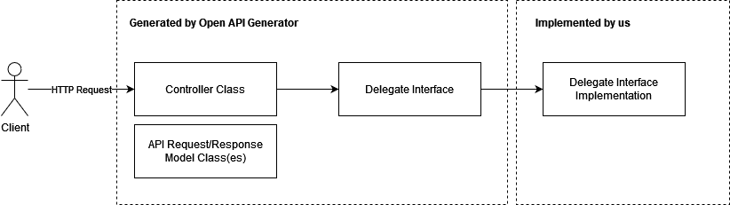
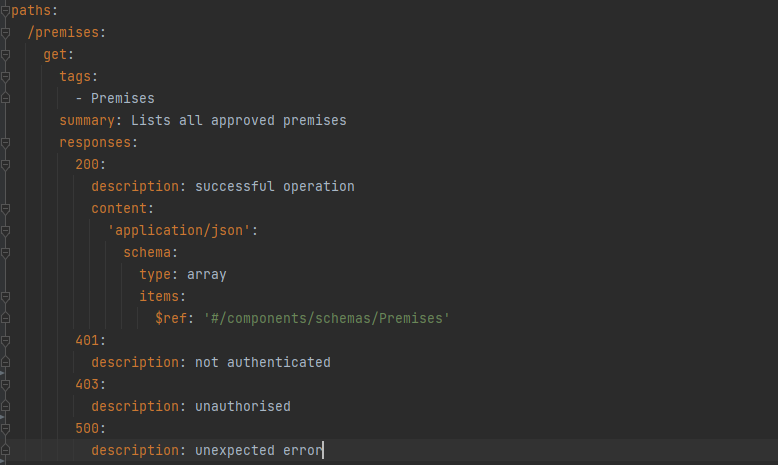
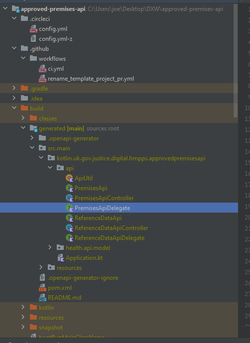
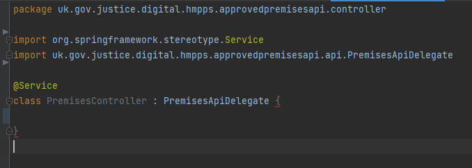
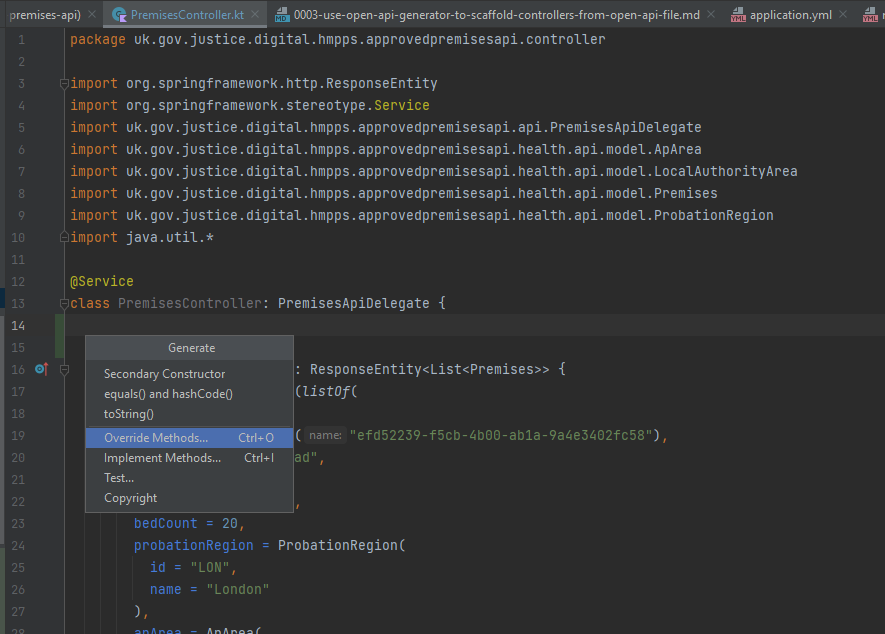
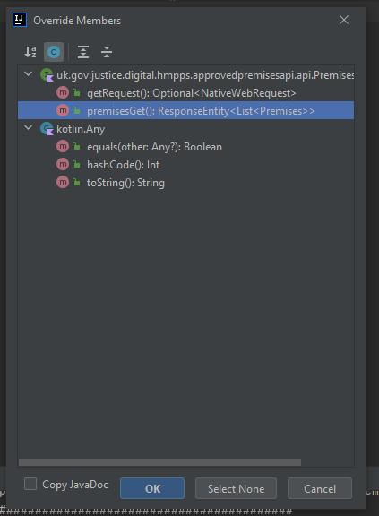
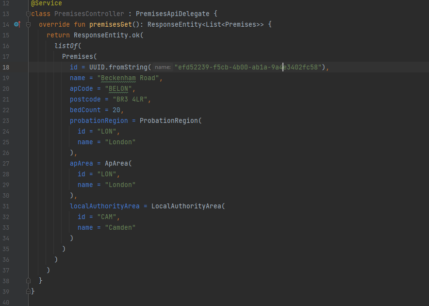

# How to add a new endpoint

The Open API Generator Gradle plugin generates boilerplate (request/response models & Spring controllers) for endpoints 
from the `src/main/resources/static/mini-manage-stubs.yml` file.  It also generates an interface for each top-level 
path which is what we need to implement.

To create a new endpoint on a top-level path:
 - Edit `src/main/resources/static/mini-manage-stubs.yml` to add your endpoint, e.g.
    
   
 - Run the `openapitools`->`openApiGenerate` Gradle Task
 - Look at `build/generated/src/main/kotlin/uk/gov/justice/digital/hmpps/approvedpremisesapi`
    
   
 - Find the Delegate interface that corresponds to the top-level path for the endpoint you added, 
   e.g. `PremisesApiDelegate`
 - In `src/main/kotlin/controller` create a new equivalently named controller class, e.g. `PremisesController` which 
   implements this interface
    
   
 - The interface has a default implementation which simply returns a 501 "Not Implemented" response when called
 - To actually implement the endpoint, press Alt + Insert (on IntelliJ) in the body of the class, select 
   `Override Methods`
    
   
 - From the dialog that appears, select one or more of the endpoints you want to implement - note that the top method 
  `getRequest()` is a fallback handler, you shouldn't ever need to worry about this method.
    
   
 - This will insert an override that simply calls the default method on the interface, replace the body of the method 
   with your implement, e.g.
    
   
